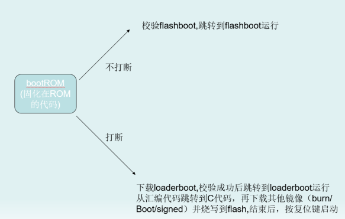

## BootLoader的启动与运行
-   Hi3861 RiSC-V boot 启动文件介绍
    -    Hi3861 的引导程序分为两部分，一部分是在芯片出厂时已经固定在 ROM，这部分的代码主要实现的功能是：芯片上电后，如果没有被打断（没有执行烧录过程）时会检验 flashboot,检验成功后跳转到flashboot 代码处运行；芯片上电后如果被打断（复位操作并执行烧录过程）时，下载 loaderboot,下载完之后校验成功跳转到 loaderboot 运行，汇编代码跳转到 C 代码，再下载其他镜像（burn、boot、signed）并烧录到 flash,结束后，按复位键，芯片启动。

    

    -    Loaderboot 启动过程：路径: ./device/soc/hisilicon/hi3861v100/sdk_liteos/boot/loaderboot/startup

    

    

    -    Loaderboot 跳转到 C 代码：

    

    

    -    Flashboot 的执行逻辑与上述的 loaderboot 执行逻辑一致。路径: ./device/soc/hisilicon/hi3861v100/sdk_liteos/boot/Flashboot/startup

    

    -    Flashboot 跳转到 C 代码：

    
