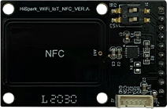

# 硬件搭建
## Pegasus套件清单介绍
| 序号  | 配件名称  | 配件图片  |  数量 |
|---|---|---|---|
| 1 | HiSpark_WiFi_IoT-主板  |   | 1  |
| 2 | HiSpark_WiFi_IoT-底板  |  | 1  |
| 3 | HiSpark_WiFi_IoT-显示模块  |   | 1  |
| 4 | HiSpark_WiFi_IoT-机器人模块  |   | 1  |
| 5 | HiSpark_WiFi_IoT-外设扩展模块  |   | 1  |
| 6 | HiSpark_WiFi_IoT-NFC板  |   | 1  |
| 7 | NFC排线  |   | 1  |
③
## 安装步骤
-    开发者根据使用场景，在安装时选择"机器人模块"或"外设扩展模块"；安装顺序如下：①取出底板->②安装主板->③安装显示模块->④安装机器人模块或外设扩展板模块->⑤安装NFC模块。

![输入图片说明]

-    请开发者根据以下步骤完成Pegasus套件安装
-    步骤1：打开"Pegasus套件包"，取出"HiSpark_WiFi_IoT-底板",如下图所示：

-    步骤2：安装"HiSpark_WiFi_IoT-主板"
     -    取出"HiSpark_WiFi_IoT-主板",将其安装至"HiSpark_WiFi_IoT-底板"指定位置，如下图所示：
     
     

-    步骤3：安装"HiSpark_WiFi_IoT-显示模块"
     -    取出"HiSpark_WiFi_IoT-显示模块",将其安装至"HiSpark_WiFi_IoT-底板"指定位置，如下图所示：

     

-    步骤4：安装"HiSpark_WiFi_IoT-机器人模块"或"HiSpark_WiFi_IoT-外设扩展模块"
     -    开发者根据使用场景，选择"机器人模块"或"外设扩展模块"（两个模块同时只能安装一个）；此处以安装"机器人模块"为例进行安装说明，取出"HiSpark_WiFi_IoT-机器人模块"，将其安装至"HiSpark_WiFi_IoT-底板"指定位置，如下图所示：

     

- 注意：安装机器人模块或外设扩展板模块时，需要注意该类模块引脚处缺少一根针，此处须与底板中实心插槽对应，如下图所示：

-    步骤5：安装"HiSpark_WiFi_IoT-NFC板"（两种安装方式）
     -    方式1：取出"HiSpark_WiFi_IoT-NFC板",将其安装至"HiSpark_WiFi_IoT-底板"NFC专用插座上，如下图所示：

     

     -    方式2：取出"HiSpark_WiFi_IoT-NFC板"和"NFC排线",使用NFC排线将"HiSpark_WiFi_IoT-底板"相互连接，如下图所示：

     

## Pegasus套件原理图

[套件原理图](http://gitee.com/hihope_iot/embedded-race-hisilicon-track-2022/blob/master/%E7%A1%AC%E4%BB%B6%E8%B5%84%E6%96%99/HiSpark_WiFi_IoT%E6%99%BA%E8%83%BD%E5%AE%B6%E5%B1%85%E5%BC%80%E5%8F%91%E5%A5%97%E4%BB%B6_%E5%8E%9F%E7%90%86%E5%9B%BE.rar)