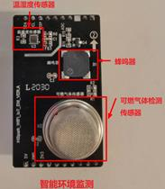
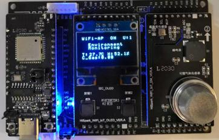
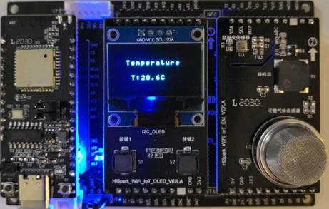
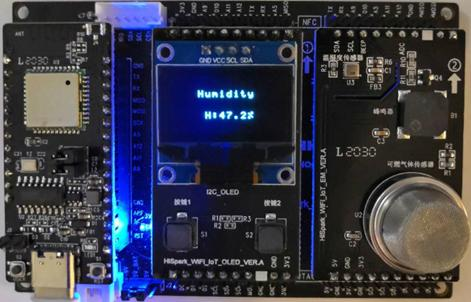

# 环境检测实验
## 硬件环境搭建
-    硬件要求：Hi3861V100核心板、扩展板，OLDE板，环境监测板；硬件搭建如下图所示。
-    [Hi3861V100核心板参考：HiSpark_WiFi_IoT智能开发套件_原理图硬件资料\原理图\HiSpark_WiFi-IoT_Hi3861_CH340G_VER.B.pdf](http://gitee.com/hihope_iot/embedded-race-hisilicon-track-2022/blob/master/%E7%A1%AC%E4%BB%B6%E8%B5%84%E6%96%99/HiSpark_WiFi_IoT%E6%99%BA%E8%83%BD%E5%AE%B6%E5%B1%85%E5%BC%80%E5%8F%91%E5%A5%97%E4%BB%B6_%E5%8E%9F%E7%90%86%E5%9B%BE.rar)
-    [扩展板参考：HiSpark_WiFi_IoT智能开发套件_原理图硬件资料\原理图\HiSpark_WiFi-IoT_Hi3861_CH340G_VER.B.pdf](http://gitee.com/hihope_iot/embedded-race-hisilicon-track-2022/blob/master/%E7%A1%AC%E4%BB%B6%E8%B5%84%E6%96%99/HiSpark_WiFi_IoT%E6%99%BA%E8%83%BD%E5%AE%B6%E5%B1%85%E5%BC%80%E5%8F%91%E5%A5%97%E4%BB%B6_%E5%8E%9F%E7%90%86%E5%9B%BE.rar)
-    [OLED板参考：HiSpark_WiFi_IoT智能开发套件_原理图硬件资料\原理图\HiSpark_WiFi_IoT_OLED_VER.A.pdf](http://gitee.com/hihope_iot/embedded-race-hisilicon-track-2022/blob/master/%E7%A1%AC%E4%BB%B6%E8%B5%84%E6%96%99/HiSpark_WiFi_IoT%E6%99%BA%E8%83%BD%E5%AE%B6%E5%B1%85%E5%BC%80%E5%8F%91%E5%A5%97%E4%BB%B6_%E5%8E%9F%E7%90%86%E5%9B%BE.rar)
-    [环境检测板硬件原理图参考：HiSpark_WiFi_IoT智能开发套件_原理图硬件资料\原理图\HiSpark_WiFi_IoT_EM_VER.A.pdf](http://gitee.com/hihope_iot/embedded-race-hisilicon-track-2022/blob/master/%E7%A1%AC%E4%BB%B6%E8%B5%84%E6%96%99/HiSpark_WiFi_IoT%E6%99%BA%E8%83%BD%E5%AE%B6%E5%B1%85%E5%BC%80%E5%8F%91%E5%A5%97%E4%BB%B6_%E5%8E%9F%E7%90%86%E5%9B%BE.rar)



## 软件介绍
-   1.代码目录结构及相应接口功能介绍
```
vendor_hisilicon/hispark_pegasus/demo/environment_demo
├── app_demo_aht20.c           # 
├── app_demo_aht20.h           #
├── app_demo_config.c          #
├── app_demo_config.h          #
├── app_demo_environment.c     # 
├── app_demo_environment.h     # 
├── app_demo_gl5537_1.c        # 
├── app_demo_i2c_oled.c        # 
├── app_demo_i2c_oled.h        # 
├── app_demo_mq2.c             # 
├── app_demo_mq2.h             # 
├── app_demo_multi_sample.c    # 
├── app_demo_multi_sample.h    # 
├── BUILD.gn                   # BUILD.gn文件由三部分内容（目标、源文件、头文件路径）构成,开发者根据需要填写,static_library中指定业务模块的编译结果，为静态库文件led_example，开发者根据实际情况完成填写。
|                                sources中指定静态库.a所依赖的.c文件及其路径，若路径中包含"//"则表示绝对路径（此处为代码根路径），若不包含"//"则表示相对路径。include_dirs中指定source所需要依赖的.h文件路径。
├── hal_iot_adc.c              # 
├── hal_iot_gpio_ex.c          #  
├── iot_adc.h                  # 
├── iot_gpio_ex.h              # 
├── ssd1306_oled.h             # 
└── task_start.c               # 
```
-   2.工程编译
    -    将源码./vendor/hisilicon/hispark_pegasus/demo目录下的environment_demo整个文件夹及内容复制到源码./applications/sample/wifi-iot/app/下。
    ```
    .
    └── applications
        └── sample
            └── wifi-iot
                └── app
                    └── environment_demo
                       └── 代码   
    ```

    -    修改源码./applications/sample/wifi-iot/app/BUILD.gn文件，在features字段中增加索引，使目标模块参与编译。features字段指定业务模块的路径和目标,features字段配置如下。
    ```
    import("//build/lite/config/component/lite_component.gni")
    
    lite_component("app") {
        features = [
            "environment_demo:appDemoEnvironment",
        ]
    }
    ```

    -    修改.device/soc/hisilicon/hi3861v100/sdk_liteos/build/config/usr_config.mk文件。在这个配置文件中打开I2C,PWM驱动宏。搜索字段CONFIG_I2C_SUPPORT ，并打开I2C,PWM。配置如下：
    ```
    # CONFIG_I2C_SUPPORT is not set
    CONFIG_I2C_SUPPORT=y
    # CONFIG_PWM_SUPPORT is not set
    CONFIG_PWM_SUPPORT=y
    ```        

    -    工程相关配置完成后,然后rebuild编译。
-   3.烧录
    -    编译成功后，点击DevEco Home->配置工程->hi3861->upload_port->选择对应串口端口号->选择upload_protocol->选择hiburn-serial->点击save保存，在保存成功后点击upload进行烧录，出现connecting, please reset device..字样复位开发板等待烧录完成。
    -    烧录成功后，再次点击Hi3861核心板上的“RST”复位键，此时开发板的系统会运行起来。运行结果：environment_demo共有4种模式，分别是Environment Monitoring模式:当进入环境监测demo，初始状态是Environment Monitoring，主要用来实时显示外部环境的温湿度以及可燃气体的浓度。OLED显示屏的最后一行文字的含义：T：Temperature温度，H：Humidity湿度，CG：Combustible Gas 可燃气体。温度、湿度和可燃气体值；Temperature Mode模式: 当再次按下左键S1时，会从Environment Monitoring模式跳到Temperature Mode模式，此模式下的OLED屏上只会显示实时的温度，通过温度传感器来实时监测外界环境的温度数据；Humidity Mode模式: 当再次按下左键S1时，会从Temperature Mode模式跳转到Humiditymode模式，此模式下的OLED屏上只会显示实时的湿度，通过湿度传感器来实时监测外界环境的湿度数据；Combustible Gas Mode模式: 当再次按下左键S1时，会从Humidity mode模式跳转到Combustible Gas Mode模式，此模式下的OLED屏上只会显示实时可燃气体浓度数据，通过可燃气体传感器来实时监测外界环境的可燃气体浓度数据。此时如果再按一下左键S1就会跳到Return Menu界面，选择Exit就可以跳转到主菜单选择界面。

    Environment Monitoring模式：

    

    Temperature Mode模式:

    

    Combustible Gas Mode模式:

    