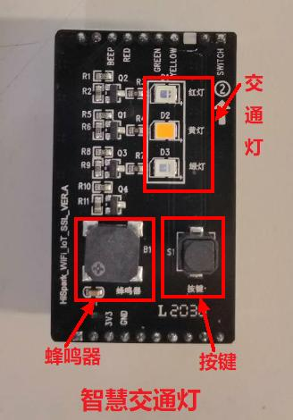
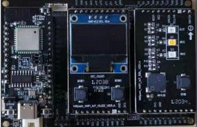
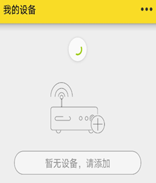
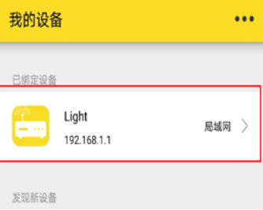
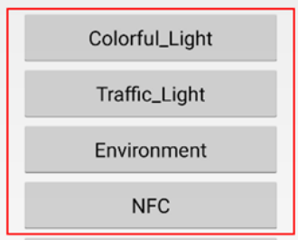

# Histreaming APP的智慧交通灯<a name="ZH-CN_TOPIC_0000001130176841"></a>
## 硬件环境搭建
-    硬件要求：Hi3861V100核心板、扩展板，OLED板，交通灯板；硬件搭建如下图所示。
-    [Hi3861V100核心板参考：HiSpark_WiFi_IoT智能开发套件_原理图硬件资料\原理图\HiSpark_WiFi-IoT_Hi3861_CH340G_VER.B.pdf](http://gitee.com/hihope_iot/embedded-race-hisilicon-track-2022/blob/master/%E7%A1%AC%E4%BB%B6%E8%B5%84%E6%96%99/HiSpark_WiFi_IoT%E6%99%BA%E8%83%BD%E5%AE%B6%E5%B1%85%E5%BC%80%E5%8F%91%E5%A5%97%E4%BB%B6_%E5%8E%9F%E7%90%86%E5%9B%BE.rar)
-    [扩展板参考：HiSpark_WiFi_IoT智能开发套件_原理图硬件资料\原理图\HiSpark_WiFi-IoT_Hi3861_CH340G_VER.B.pdf](http://gitee.com/hihope_iot/embedded-race-hisilicon-track-2022/blob/master/%E7%A1%AC%E4%BB%B6%E8%B5%84%E6%96%99/HiSpark_WiFi_IoT%E6%99%BA%E8%83%BD%E5%AE%B6%E5%B1%85%E5%BC%80%E5%8F%91%E5%A5%97%E4%BB%B6_%E5%8E%9F%E7%90%86%E5%9B%BE.rar)
-    [OLED板参考：HiSpark_WiFi_IoT智能开发套件_原理图硬件资料\原理图\HiSpark_WiFi_IoT_OLED_VER.A.pdf](http://gitee.com/hihope_iot/embedded-race-hisilicon-track-2022/blob/master/%E7%A1%AC%E4%BB%B6%E8%B5%84%E6%96%99/HiSpark_WiFi_IoT%E6%99%BA%E8%83%BD%E5%AE%B6%E5%B1%85%E5%BC%80%E5%8F%91%E5%A5%97%E4%BB%B6_%E5%8E%9F%E7%90%86%E5%9B%BE.rar)
-    [交通灯板硬件原理图参考：HiSpark_WiFi_IoT智能开发套件_原理图硬件资料\原理图\HiSpark_WiFi_IoT_SSL_VER.A.pdf](http://gitee.com/hihope_iot/embedded-race-hisilicon-track-2022/blob/master/%E7%A1%AC%E4%BB%B6%E8%B5%84%E6%96%99/HiSpark_WiFi_IoT%E6%99%BA%E8%83%BD%E5%AE%B6%E5%B1%85%E5%BC%80%E5%8F%91%E5%A5%97%E4%BB%B6_%E5%8E%9F%E7%90%86%E5%9B%BE.rar)



## 软件介绍

-   1.代码目录结构及相应接口功能介绍

-   WiFi API

| API                                                          | 接口说明                                |
| ------------------------------------------------------------ | --------------------------------------- |
| WifiErrorCode EnableWifi(void);                              | 开启STA                                 |
| WifiErrorCode DisableWifi(void);                             | 关闭STA                                 |
| int IsWifiActive(void);                                      | 查询STA是否已开启                       |
| WifiErrorCode Scan(void);                                    | 触发扫描                                |
| WifiErrorCode GetScanInfoList(WifiScanInfo* result, unsigned int* size); | 获取扫描结果                            |
| WifiErrorCode AddDeviceConfig(const WifiDeviceConfig* config, int* result); | 添加热点配置，成功会通过result传出netld |
| WifiErrorCode GetDeviceConfigs(WifiDeviceConfig* result, unsigned int* size); | 获取本机所有热点配置                    |
| WifiErrorCode RemoveDevice(int networkId);                   | 删除热点配置                            |
| WifiErrorCode ConnectTo(int networkId);                      | 连接到热点                              |
| WifiErrorCode Disconnect(void);                              | 断开热点连接                            |
| WifiErrorCode GetLinkedInfo(WifiLinkedInfo* result);         | 获取当前连接热点信息                    |
| WifiErrorCode RegisterWifiEvent(WifiEvent* event);           | 注册事件监听                            |
| WifiErrorCode UnRegisterWifiEvent(const WifiEvent* event);   | 解除事件监听                            |
| WifiErrorCode GetDeviceMacAddress(unsigned char* result);    | 获取Mac地址                             |
| WifiErrorCode AdvanceScan(WifiScanParams *params);           | 高级搜索                                |

-   DHCP客户端接口：

| API                 | 描述               |
| ------------------- | ------------------ |
| netifapi_netif_find | 按名称查找网络接口 |
| netifapi_dhcp_start | 启动DHCP客户端     |
| netifapi_dhcp_stop  | 停止DHCP客户端     |

-   HiStreaming接口：

| API                 | 描述               |
| ------------------- | ------------------ |
| LinkPlatformGe | 获得HiStreamingLinkLite组件对象 |
| LinkPlatformFree | 释放HiStreamingLinkLite组件对象     |
| LinkServiceAgentFree  | 释放从设备列表中pop出来的LinkServiceAgent对象     |
| LinkAgentGet  | 获得LinkAgent对象     |
| LinkAgentFree  | 释放LinkAgent对象    |
| QueryResultFree  | 释放设备列表QueryResult。同时也释放设备列表关联的LinkServiceAgent对象    |

-   2.工程编译
    -    将源码./vendor/hisilicon/hispark_pegasus/demo目录下的histreaming_demo整个文件夹及内容复制到源码./applications/sample/wifi-iot/app/下。
    ```
    .
    └── applications
        └── sample
            └── wifi-iot
                └── app
                    └──histreaming_demo
                       └── 代码
    ```

    -    修改源码./applications/sample/wifi-iot/app/BUILD.gn文件，在features字段中增加索引，使目标模块参与编译。features字段指定业务模块的路径和目标,features字段配置如下。
    ```
    import("//build/lite/config/component/lite_component.gni")
    
    lite_component("app") {
        features = [
            "histreaming_demo:appDemoTraffic",
        ]
    }
    ```

    -    修改.device/soc/hisilicon/hi3861v100/sdk_liteos/build/config/usr_config.mk文件。在这个配置文件中打开I2C,PWM驱动宏。搜索字段CONFIG_I2C_SUPPORT ，并打开I2C,PWM。配置如下：
    ```
    # CONFIG_I2C_SUPPORT is not set
    CONFIG_I2C_SUPPORT=y
    # CONFIG_PWM_SUPPORT is not set
    CONFIG_PWM_SUPPORT=y
    ```        

    -    工程相关配置完成后,然后rebuild编译。
-   3.烧录
    -    编译成功后，点击DevEco Home->配置工程->hi3861->upload_port->选择对应串口端口号->选择upload_protocol->选择hiburn-serial->点击save保存，在保存成功后点击upload进行烧录，出现connecting, please reset device..字样复位开发板等待烧录完成。
    -    烧录成功后，再次点击Hi3861核心板上的“RST”复位键，此时开发板的系统会运行起来。  
-   4.手机端安装及使用（[开发源码](https://gitee.com/leo593362220/shistreaming.git)）

4.1 手机端安装HistreamingAPP,手机wifi连接Hi3861主板发射出来的热点。

4.2 打开HistreamingAPP，点击“局域网”，如果打开APP后没有马上出现“已绑定设备”，请往下滑不断刷新，直到出现绑定设备即可。

 

4.3 点击“局域网”进去后，可以看到“Colorful_Light”、“Traffic_Light”等界面，点击app界面的“Traffic_Light”，进去之后可以看到“Control_Module”、“AutoModule”等，这时点击“Control_Module”，进去之后，连续点击button，即可看到控制设备侧的灯在切换。其他模式，用户可自行体验。其中点击“Return_Menu_Module”是返回主界面。



4.4 实验结果：手机可以控制Hi3861V100实现三种交通灯模式切换，分别为Control Mode: 进入Traffic Light demo，初始状态就是Control Mode，是通过右边按键S2来控制红、黄、绿灯的亮灭状态不断切换。按键按下开启蜂鸣器，按键再次按下关闭；Auto Mode: 当按下左键S1时，会从control mode跳到Auto mode，交通灯模式，模仿交通灯，红灯常亮5秒，然后闪烁3秒，后黄灯闪烁3秒，后绿灯常亮5秒，再是绿灯闪烁3秒，如此循环，蜂鸣器开启后会响。最后一行的R，Y，G后面的数字代表倒数的时间，动态显示，时间的单位是秒，R代表红灯，Y代表黄灯，G代表绿灯，B代表的是蜂鸣器，数字“1”代表蜂鸣器打开状态，数字“0”代表蜂鸣器关闭状态。Human Mode: 当再次按下左键S1时，会从Auto mode跳到Human Mode模式，就是在Auto mode的基础上增加了人为控制，且红灯常亮改为30秒。模仿交通灯，红灯常亮30秒后闪烁3秒，黄灯闪烁3秒，然后绿灯常亮5秒，绿灯闪烁3秒，如此循环。如果按下右键S2，红灯立即快闪3秒，黄灯快闪3秒，进入绿灯常亮5秒，再绿灯闪烁3秒，后进入正常循环。蜂鸣器开启后会响。此时如果再按一下左键S1就会跳到Return Menu界面，选择按下Continue继续demo循环
