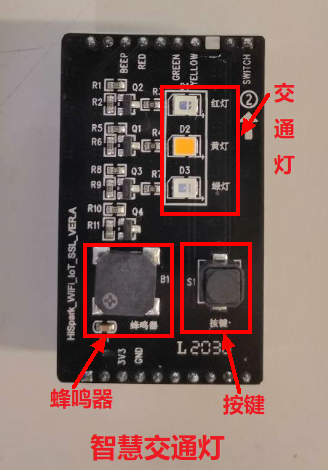
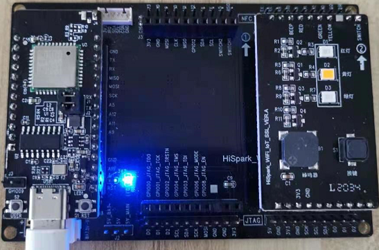

# Led实验<a name="ZH-CN_TOPIC_0000001130176841"></a>
## 硬件环境搭建
-    硬件要求：Hi3861V100核心板、扩展板、交通灯板；硬件搭建如下图所示。
-    [Hi3861V100核心板参考：HiSpark_WiFi_IoT智能开发套件_原理图硬件资料\原理图\HiSpark_WiFi-IoT_Hi3861_CH340G_VER.B.pdf](http://gitee.com/hihope_iot/embedded-race-hisilicon-track-2022/blob/master/%E7%A1%AC%E4%BB%B6%E8%B5%84%E6%96%99/HiSpark_WiFi_IoT%E6%99%BA%E8%83%BD%E5%AE%B6%E5%B1%85%E5%BC%80%E5%8F%91%E5%A5%97%E4%BB%B6_%E5%8E%9F%E7%90%86%E5%9B%BE.rar)
-    [扩展板参考：HiSpark_WiFi_IoT智能开发套件_原理图硬件资料\原理图\HiSpark_WiFi-IoT_Hi3861_CH340G_VER.B.pdf](http://gitee.com/hihope_iot/embedded-race-hisilicon-track-2022/blob/master/%E7%A1%AC%E4%BB%B6%E8%B5%84%E6%96%99/HiSpark_WiFi_IoT%E6%99%BA%E8%83%BD%E5%AE%B6%E5%B1%85%E5%BC%80%E5%8F%91%E5%A5%97%E4%BB%B6_%E5%8E%9F%E7%90%86%E5%9B%BE.rar)
-    [交通灯板硬件原理图参考：HiSpark_WiFi_IoT智能开发套件_原理图硬件资料\原理图\HiSpark_WiFi_IoT_SSL_VER.A.pdf](http://gitee.com/hihope_iot/embedded-race-hisilicon-track-2022/blob/master/%E7%A1%AC%E4%BB%B6%E8%B5%84%E6%96%99/HiSpark_WiFi_IoT%E6%99%BA%E8%83%BD%E5%AE%B6%E5%B1%85%E5%BC%80%E5%8F%91%E5%A5%97%E4%BB%B6_%E5%8E%9F%E7%90%86%E5%9B%BE.rar)



## 软件介绍
-   1.代码目录结构及相应接口功能介绍
-   GPIO API

| API名称                                                      | 说明                                                         |
| ------------------------------------------------------------ | ------------------------------------------------------------ |
| unsigned int GpioInit(void);                                 | GPIO模块初始化                                               |
| unsigned int GpioSetDir(WifiIotGpioIdx id, WifiIotGpioDir dir); | 设置GPIO引脚方向，id参数用于指定引脚，dir参数用于指定输入或输出 |
| unsigned int GpioSetOutputVal(WifiIotGpioIdx id, WifiIotGpioValue val); | 设置GPIO引脚的输出状态，id参数用于指定引脚，val参数用于指定高电平或低电平 |
| unsigned int IoSetFunc(WifiIotIoName id, unsigned char val); | 设置引脚功能，id参数用于指定引脚，val用于指定引脚功能        |
| unsigned int GpioDeinit(void);                               | 解除GPIO模块初始化                                           |

-   2.工程编译
    -   将源码./vendor/hisilicon/hispark_pegasus/demo目录下的led_demo整个文件夹及内容复制到源码./applications/sample/wifi-iot/app/下，如图。
    ```
    .
    └── applications
        └── sample
            └── wifi-iot
                └── app
                    └──led_demo
                       └── 代码
    ```

    -   修改源码./applications/sample/wifi-iot/app/BUILD.gn文件，在features字段中增加索引，使目标模块参与编译。features字段指定业务模块的路径和目标,features字段配置如下。
    ```
    import("//build/lite/config/component/lite_component.gni")
    
    lite_component("app") {
        features = [
            "led_demo:ledDemo",
        ]
    }
    ```

    -    工程相关配置完成后,然后rebuild编译。
-   3.烧录
    -   编译成功后，点击DevEco Home->配置工程->hi3861->upload_port->选择对应串口端口号->选择upload_protocol->选择hiburn-serial->点击save保存，在保存成功后点击upload进行烧录，出现connecting, please reset device..字样复位开发板等待烧录完成。
    -   烧录成功后，再次点击Hi3861核心板上的“RST”复位键，此时开发板的系统会运行起来。运行结果：红灯亮。如下图所示。

    

