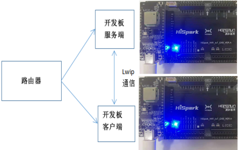
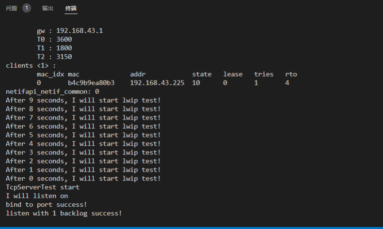

# LWIP协议的TCP/IP通信<a name="ZH-CN_TOPIC_0000001130176841"></a>

## 硬件环境搭建
-    硬件要求：Hi3861V100核心板、扩展板；硬件搭建及组网图如下图所示。
-    [Hi3861V100核心板参考：HiSpark_WiFi_IoT智能开发套件_原理图硬件资料\原理图\HiSpark_WiFi-IoT_Hi3861_CH340G_VER.B.pdf](http://gitee.com/hihope_iot/embedded-race-hisilicon-track-2022/blob/master/%E7%A1%AC%E4%BB%B6%E8%B5%84%E6%96%99/HiSpark_WiFi_IoT%E6%99%BA%E8%83%BD%E5%AE%B6%E5%B1%85%E5%BC%80%E5%8F%91%E5%A5%97%E4%BB%B6_%E5%8E%9F%E7%90%86%E5%9B%BE.rar)
-    [扩展板参考：HiSpark_WiFi_IoT智能开发套件_原理图硬件资料\原理图\HiSpark_WiFi-IoT_Hi3861_CH340G_VER.B.pdf](http://gitee.com/hihope_iot/embedded-race-hisilicon-track-2022/blob/master/%E7%A1%AC%E4%BB%B6%E8%B5%84%E6%96%99/HiSpark_WiFi_IoT%E6%99%BA%E8%83%BD%E5%AE%B6%E5%B1%85%E5%BC%80%E5%8F%91%E5%A5%97%E4%BB%B6_%E5%8E%9F%E7%90%86%E5%9B%BE.rar)



## 软件介绍
-   1.代码目录结构及相应接口功能介绍
```
vendor_hisilicon/hispark_pegasus/demo/lwip_demo
├── BUILD.gn                 # BUILD.gn文件由三部分内容（目标、源文件、头文件路径）构成,开发者根据需要填写,static_library中指定业务模块的编译结果，为静态库文件netDemo，开发者根据实际情况完成填写。
|                              sources中指定静态库.a所依赖的.c文件及其路径，若路径中包含"//"则表示绝对路径（此处为代码根路径），若不包含"//"则表示相对路径。include_dirs中指定source所需要依赖的.h文件路径。
├── demo_entry_cmsis.c       # 
├── demo_entry_posix.c       #
├── lwip_tcp_client.c        # 
├── lwip_tcp_server.c        # 
├── net_demo.h               # 
├── net_params.h             # 
├── wifi_connecter.c         # 
├── wifi_connecter.h         # 
└── oled_ssd1306.h           # 
```
-   2.工程编译
    -   将源码./vendor/hisilicon/hispark_pegasus/demo目录下的lwip_demo整个文件夹及内容复制到源码./applications/sample/wifi-iot/app/下，如下图所示。
    ```
    .
    └── applications
        └── sample
            └── wifi-iot
                └── app
                    └──lwip_demo
                       └── 代码
    ```

    -   编译lwip_tcp_server端，修改./applications/sample/wifi-iot/app/lwip_demo/BUILD.gn文件中,在sources = [ "lwip_tcp_server.c" ]字段中添加,如下图所示。
    ```
    static_library("netDemo") {
      sources = [ "lwip_tcp_server.c" ]

      sources += [
        "demo_entry_cmsis.c",
        "wifi_connecter.c",
      ]

      include_dirs = [
        "//utils/native/lite/include",
        "//kernel/liteos_m/components/cmsis/2.0",
        "//base/iot_hardware/interfaces/kits/wifiiot_lite",
        "//base/iothardware/peripheral/interfaces/inner_api",
        "//foundation/communication/wifi_lite/interfaces/wifiservice",
      ]
    }
    ```

    -   修改./applications/sample/wifi-iot/app/lwip_demo/net_params.h文件中内容，PARAM_HOTSPOT_SSID设置为网络名称，PARAM_HOTSPOT_PSK设置为网络密码。
    ```
    #define PARAM_HOTSPOT_SSID "xxx"   // your AP SSID
    #define PARAM_HOTSPOT_PSK  "xxxxx"  // your AP PSK
    ```

    -   修改源码./applications/sample/wifi-iot/app/BUILD.gn文件，在features字段中增加索引，使目标模块参与编译。features字段指定业务模块的路径和目标,features字段配置如下图所示。
    ```
    import("//build/lite/config/component/lite_component.gni")
    
    lite_component("app") {
        features = [
            "lwip_demo:netDemo",
        ]
    }
    ```

    -   修改完成后编译rebuild,烧录到Hi3861V100开发板上，烧录成功后，再次点击Hi3861核心板上的“RST”复位键，在串口工具栏可以看到server服务端IP地址，如下图所示。

    

    -   修改./applications/sample/wifi-iot/app/lwip_demo/net_params.h中PARAM_SERVER_ADDR字段为server服务端IP地址，同时PARAM_HOTSPOT_SSID设置为网络名称，PARAM_HOTSPOT_PSK设置为网络密码,这里注意Hi3861V100服务端与客户端需要在同一个局域网内。
    ```
    #define PARAM_HOTSPOT_SSID "xxx"   // your AP SSID
    #define PARAM_HOTSPOT_PSK  "xxxxx"  // your AP PSK
    #define PARAM_SERVER_ADDR "服务端IP地址" // your PC IP address
    ```

    -   编译lwip_tcp_client端，修改./applications/sample/wifi-iot/app/lwip_demo/BUILD.gn文件中,在sources = [ "lwip_tcp_client.c" ]字段中添加。
    ```
    static_library("netDemo") {
      sources = [ "lwip_tcp_client.c" ]

      sources += [
        "demo_entry_cmsis.c",
        "wifi_connecter.c",
      ]

      include_dirs = [
        "//utils/native/lite/include",
        "//kernel/liteos_m/components/cmsis/2.0",
        "//base/iot_hardware/interfaces/kits/wifiiot_lite",
        "//base/iothardware/peripheral/interfaces/inner_api",
        "//foundation/communication/wifi_lite/interfaces/wifiservice",
      ]
    }
    ```

    -   修改源码./applications/sample/wifi-iot/app/BUILD.gn文件，在features字段中增加索引，使目标模块参与编译。features字段指定业务模块的路径和目标,features字段配置如下。
    ```
    import("//build/lite/config/component/lite_component.gni")
    
    lite_component("app") {
        features = [
            "lwip_demo:netDemo",
        ]
    }
    ```

    -    工程相关配置完成后,然后rebuild编译。
-   3.HiBurn烧录
    -   编译成功后，点击DevEco Home->配置工程->hi3861->upload_port->选择对应串口端口号->选择upload_protocol->选择hiburn-serial->点击save保存，在保存成功后点击upload进行烧录，出现connecting, please reset device..字样复位开发板等待烧录完成。
    -   烧录成功后，再次点击Hi3861核心板上的“RST”复位键，此时开发板的系统会运行起来。运行结果：在串口工具栏看到Hello,I am lwip。
    服务端串口打印：

    

    客户端串口打印：

    