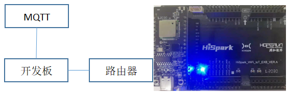
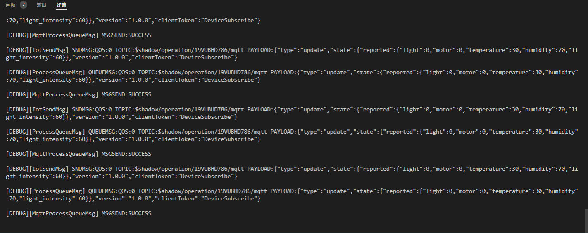

# MQTT的通信实验<a name="ZH-CN_TOPIC_0000001130176841"></a>
## 硬件环境搭建
-    硬件要求：Hi3861V100核心板、扩展板；硬件搭建如下图所示。
-    [Hi3861V100核心板参考：HiSpark_WiFi_IoT智能开发套件_原理图硬件资料\原理图\HiSpark_WiFi-IoT_Hi3861_CH340G_VER.B.pdf](http://gitee.com/hihope_iot/embedded-race-hisilicon-track-2022/blob/master/%E7%A1%AC%E4%BB%B6%E8%B5%84%E6%96%99/HiSpark_WiFi_IoT%E6%99%BA%E8%83%BD%E5%AE%B6%E5%B1%85%E5%BC%80%E5%8F%91%E5%A5%97%E4%BB%B6_%E5%8E%9F%E7%90%86%E5%9B%BE.rar)
-    [扩展板参考：HiSpark_WiFi_IoT智能开发套件_原理图硬件资料\原理图\HiSpark_WiFi-IoT_Hi3861_CH340G_VER.B.pdf](http://gitee.com/hihope_iot/embedded-race-hisilicon-track-2022/blob/master/%E7%A1%AC%E4%BB%B6%E8%B5%84%E6%96%99/HiSpark_WiFi_IoT%E6%99%BA%E8%83%BD%E5%AE%B6%E5%B1%85%E5%BC%80%E5%8F%91%E5%A5%97%E4%BB%B6_%E5%8E%9F%E7%90%86%E5%9B%BE.rar)



## 软件介绍

-   1.代码目录结构及相应接口功能介绍
```
vendor_hisilicon/hispark_pegasus/demo/mqtt_demo
├── app_demo_iot.c      #
├── BUILD.gn            # BUILD.gn文件由三部分内容（目标、源文件、头文件路径）构成,开发者根据需要填写,static_library中指定业务模块的编译结果，为静态库文件mqttDemo，开发者根据实际情况完成填写。
|                        sources中指定静态库.a所依赖的.c文件及其路径，若路径中包含"//"则表示绝对路径（此处为代码根路径），若不包含"//"则表示相对路径。include_dirs中指定source所需要依赖的.h文件路径。
├── cjson_init.c        #
├── iot_config.h        # 
├── iot_hmac.c          # 
├── iot_hmac.h          # 
├── iot_log.c           # 
├── iot_log.h           # 
├── iot_main.c          # 
├── iot_main.h          # 
├── iot_profile.c       # 
├── iot_profile.h       # 
└── iot_sta.c           # 
```
-   2.工程编译
    -   将源码./vendor/hisilicon/hispark_pegasus/demo目录下的mqtt_demo整个文件夹及内容复制到源码./applications/sample/wifi-iot/app/下。
    ```
    .
    └── applications
        └── sample
            └── wifi-iot
                └── app
                    └──mqtt_demo
                       └── 代码   
     ```

    -   修改./applications/sample/wifi-iot/app/mqtt_demo/iot_config.h中CONFIG_AP_SSID，CONFIG_AP_PWD为WiFi名称和WiFi密码。
    ```
    #define CONFIG_AP_SSID  "xxx" // WIFI SSID
    #define CONFIG_AP_PWD "xxxxxx" // WIFI PWD
    ```

    -   修改源码./applications/sample/wifi-iot/app/BUILD.gn文件，在features字段中增加索引，使目标模块参与编译。features字段指定业务模块的路径和目标,features字段配置如下。
    ```
    import("//build/lite/config/component/lite_component.gni")
    
    lite_component("app") {
        features = [
            "mqtt_demo:mqttDemo",
        ]
    }
    ```

    -    工程相关配置完成后,然后rebuild编译。
-   3.烧录
    -    编译成功后，点击DevEco Home->配置工程->hi3861->upload_port->选择对应串口端口号->选择upload_protocol->选择hiburn-serial->点击save保存，在保存成功后点击upload进行烧录，出现connecting, please reset device..字样复位开发板等待烧录完成。
    -    烧录成功后，再次点击Hi3861核心板上的“RST”复位键，此时开发板的系统会运行起来。运行结果：在串口工具看到MSGSEND:SUCCESS代表mqtt通信成功，MSGSEND:failed代表mqtt通信失败。如下图所示。

    