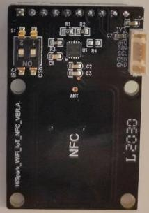
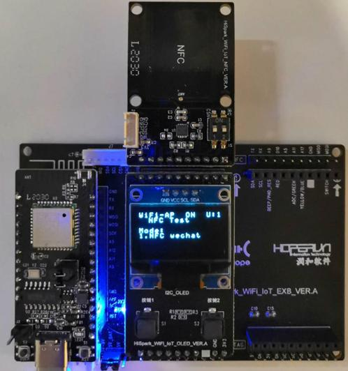
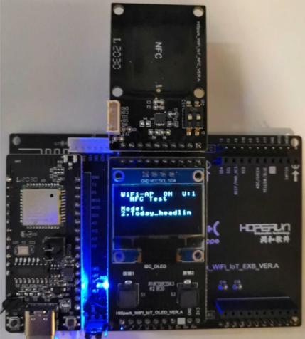
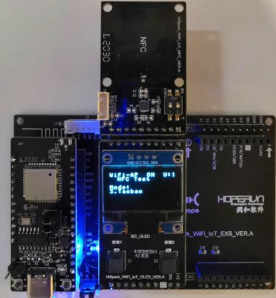

# NFC实验
## 硬件环境搭建
-    硬件要求：Hi3861V100核心板、扩展板，OLDE板，NFC板；硬件搭建如下图所示。
-    [Hi3861V100核心板参考：HiSpark_WiFi_IoT智能开发套件_原理图硬件资料\原理图\HiSpark_WiFi-IoT_Hi3861_CH340G_VER.B.pdf](http://gitee.com/hihope_iot/embedded-race-hisilicon-track-2022/blob/master/%E7%A1%AC%E4%BB%B6%E8%B5%84%E6%96%99/HiSpark_WiFi_IoT%E6%99%BA%E8%83%BD%E5%AE%B6%E5%B1%85%E5%BC%80%E5%8F%91%E5%A5%97%E4%BB%B6_%E5%8E%9F%E7%90%86%E5%9B%BE.rar)
-    [扩展板参考：HiSpark_WiFi_IoT智能开发套件_原理图硬件资料\原理图\HiSpark_WiFi-IoT_Hi3861_CH340G_VER.B.pdf](http://gitee.com/hihope_iot/embedded-race-hisilicon-track-2022/blob/master/%E7%A1%AC%E4%BB%B6%E8%B5%84%E6%96%99/HiSpark_WiFi_IoT%E6%99%BA%E8%83%BD%E5%AE%B6%E5%B1%85%E5%BC%80%E5%8F%91%E5%A5%97%E4%BB%B6_%E5%8E%9F%E7%90%86%E5%9B%BE.rar)
-    [OLED板参考：HiSpark_WiFi_IoT智能开发套件_原理图硬件资料\原理图\HiSpark_WiFi_IoT_OLED_VER.A.pdf](http://gitee.com/hihope_iot/embedded-race-hisilicon-track-2022/blob/master/%E7%A1%AC%E4%BB%B6%E8%B5%84%E6%96%99/HiSpark_WiFi_IoT%E6%99%BA%E8%83%BD%E5%AE%B6%E5%B1%85%E5%BC%80%E5%8F%91%E5%A5%97%E4%BB%B6_%E5%8E%9F%E7%90%86%E5%9B%BE.rar)
-    [NFC板硬件原理图参考：HiSpark_WiFi_IoT智能开发套件_原理图硬件资料\原理图\HiSpark_WiFi_IoT_NFC_VER.A.pdf](http://gitee.com/hihope_iot/embedded-race-hisilicon-track-2022/blob/master/%E7%A1%AC%E4%BB%B6%E8%B5%84%E6%96%99/HiSpark_WiFi_IoT%E6%99%BA%E8%83%BD%E5%AE%B6%E5%B1%85%E5%BC%80%E5%8F%91%E5%A5%97%E4%BB%B6_%E5%8E%9F%E7%90%86%E5%9B%BE.rar)



## 软件介绍
-   1.代码目录结构及相应接口功能介绍
```
vendor_hisilicon/hispark_pegasus/demo/nfc_demo
├── app_demo_config.c           #
├── app_demo_config.h           #
├── app_demo_gl5537_1.c         # 
├── app_demo_i2c_oled.c         # 
├── app_demo_multi_sample.c     # 
├── app_demo_multi_sample.h     # 
├── app_demo_nfc.c              # 
├── BUILD.gn                    # BUILD.gn文件由三部分内容（目标、源文件、头文件路径）构成,开发者根据需要填写,static_library中指定业务模块的编译结果，为静态库文件led_example，开发者根据实际情况完成填写。
|                                 sources中指定静态库.a所依赖的.c文件及其路径，若路径中包含"//"则表示绝对路径（此处为代码根路径），若不包含"//"则表示相对路径。include_dirs中指定source所需要依赖的.h文件路径。
├── c081_nfc.h                  # 
├── hal_iot_adc.c               # 
├── hal_iot_gpio_ex.c           #  
├── iot_adc.h                   # 
├── iot_gpio_ex.h               #  
└── ssd1306_oled.c              # 
```
-   2.工程编译
    -    将源码./vendor/hisilicon/hispark_pegasus/demo目录下的nfc_demo整个文件夹及内容复制到源码./applications/sample/wifi-iot/app/下。
    ```
    .
    └── applications
        └── sample
            └── wifi-iot
                └── app
                    └──nfc_demo
                       └── 代码
    ```

    -    修改源码./applications/sample/wifi-iot/app下的BUILD.gn文件，在features字段中增加索引，使目标模块参与编译。features字段指定业务模块的路径和目标,features字段配置如下。
    ```
    import("//build/lite/config/component/lite_component.gni")
    
    lite_component("app") {
        features = [
            "nfc_demo:appDemoNfc",
        ]
    }
    ```

    -    工程相关配置完成后,然后rebuild编译。
-   3.烧录
    -    编译成功后，点击DevEco Home->配置工程->hi3861->upload_port->选择对应串口端口号->选择upload_protocol->选择hiburn-serial->点击save保存，在保存成功后点击upload进行烧录，出现connecting, please reset device..字样复位开发板等待烧录完成。
    -    烧录成功后，再次点击Hi3861核心板上的“RST”复位键，此时开发板的系统会运行起来。运行结果：NFC demo一共拉起3个APP，按键切换拉起不同应用。（注：手机上需事先安装下面的APP应用，手机需要有NFC功能，使用前请用户先打开手机的NFC功能），分别是Wechat模式: NFC demo初始状态是WeChat ，也就是用手机靠近贴着NFC板，就会调起手机的微信APP；Today Headline模式 : 再按下左键S1，会从WeChat mode跳到 Today Headline mode，用手机靠近贴着NFC板，就会调起手机的今日头条APP；Tobao模式: 再按下左键S1，会从Today Headline mode跳到Taobao mode，用手机靠近贴着NFC板，就会调起手机的淘宝APP。

    Wechat 模式:

    

    Today Headline模式 : 

    

    Tobao模式:

    