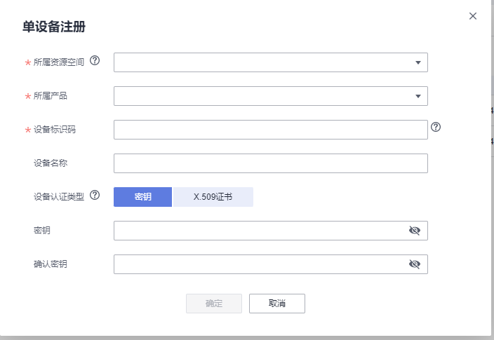

# 华为云的智能交通灯上报<a name="ZH-CN_TOPIC_0000001130176841"></a>
## 硬件环境搭建
-    硬件要求：Hi3861V100核心板、扩展板，OLED板，交通灯板；硬件搭建及组网图如下图所示。
-    [Hi3861V100核心板参考：HiSpark_WiFi_IoT智能开发套件_原理图硬件资料\原理图\HiSpark_WiFi-IoT_Hi3861_CH340G_VER.B.pdf](http://gitee.com/hihope_iot/embedded-race-hisilicon-track-2022/blob/master/%E7%A1%AC%E4%BB%B6%E8%B5%84%E6%96%99/HiSpark_WiFi_IoT%E6%99%BA%E8%83%BD%E5%AE%B6%E5%B1%85%E5%BC%80%E5%8F%91%E5%A5%97%E4%BB%B6_%E5%8E%9F%E7%90%86%E5%9B%BE.rar)
-    [扩展板参考：HiSpark_WiFi_IoT智能开发套件_原理图硬件资料\原理图\HiSpark_WiFi-IoT_Hi3861_CH340G_VER.B.pdf](http://gitee.com/hihope_iot/embedded-race-hisilicon-track-2022/blob/master/%E7%A1%AC%E4%BB%B6%E8%B5%84%E6%96%99/HiSpark_WiFi_IoT%E6%99%BA%E8%83%BD%E5%AE%B6%E5%B1%85%E5%BC%80%E5%8F%91%E5%A5%97%E4%BB%B6_%E5%8E%9F%E7%90%86%E5%9B%BE.rar)
-    [OLED板参考：HiSpark_WiFi_IoT智能开发套件_原理图硬件资料\原理图\HiSpark_WiFi_IoT_OLED_VER.A.pdf](http://gitee.com/hihope_iot/embedded-race-hisilicon-track-2022/blob/master/%E7%A1%AC%E4%BB%B6%E8%B5%84%E6%96%99/HiSpark_WiFi_IoT%E6%99%BA%E8%83%BD%E5%AE%B6%E5%B1%85%E5%BC%80%E5%8F%91%E5%A5%97%E4%BB%B6_%E5%8E%9F%E7%90%86%E5%9B%BE.rar)
-    [交通灯板硬件原理图参考：HiSpark_WiFi_IoT智能开发套件_原理图硬件资料\原理图\HiSpark_WiFi_IoT_SSL_VER.A.pdf](http://gitee.com/hihope_iot/embedded-race-hisilicon-track-2022/blob/master/%E7%A1%AC%E4%BB%B6%E8%B5%84%E6%96%99/HiSpark_WiFi_IoT%E6%99%BA%E8%83%BD%E5%AE%B6%E5%B1%85%E5%BC%80%E5%8F%91%E5%A5%97%E4%BB%B6_%E5%8E%9F%E7%90%86%E5%9B%BE.rar)


## 软件介绍

-   1.代码目录结构及相应接口功能介绍
```
vendor_hisilicon/hispark_pegasus/demo/oc_demo
├── app_demo_config.c           #
├── app_demo_config.h           #
├── app_demo_gl5537_1.c         # 
├── app_demo_i2c_oled.c         # 
├── app_demo_i2c_oled.h         # 
├── BUILD.gn                    # BUILD.gn文件由三部分内容（目标、源文件、头文件路径）构成,开发者根据需要填写,static_library中指定业务模块的编译结果，为静态库文件led_example，开发者根据实际情况完成填写。
|                                 sources中指定静态库.a所依赖的.c文件及其路径，若路径中包含"//"则表示绝对路径（此处为代码根路径），若不包含"//"则表示相对路径。include_dirs中指定source所需要依赖的.h文件路径。
├── cjson_init.c                # 
├── app_demo_multi_sample.c     # 
├── app_demo_multi_sample.h     # 
├── app_demo_traffic_sample.c   # 
├── app_demo_traffic_sample.h   # 
├── hal_iot_adc.c               # 
├── hal_iot_gpio_ex.c           # 
├── iot_config.h                # 
├── iot_adc.h                   # 
├── iot_gpio_ex.h               # 
├── ssd1306_oled.h              # 
├── iot_hmac.c                  # 
├── iot_hmac.h                  # 
├── iot_log.c                   # 
├── iot_log.h                   # 
├── iot_main.c                  # 
├── iot_main.h                  # 
├── iot_profile.c               # 
├── iot_profile.h               # 
├── task_start.c                # 
├── iot_sta.c                   # 
├── wifi_connecter.c            # 
└── wifi_connecter.h            # 
```

-   2.华为云配置

2.1 注册华为云账号，打开华为云网址，点击注册后登陆。网址如下：https://www.huaweicloud.com/product/iothub.html。


2.2 登陆后，在搜索框中输入“IOTDA”，在弹出选项中选择“设备接入IOTDA”点击进去，再点击“立即使用或者免费试用”。


2.3 创建产品及相关属性，点击左边任务栏的“产品”同时选择控制台地址为“北京四”，然后点击最右上角的“创建产品”（产品名称可自定义）。注意：创建产品时如果所属空间为NULL，请先实名注册。


2.5 创建成功后，点击查看详情，点击“自定义模型”创建用户自己的模型：


2.6 用户根据自己需要自己定义，如为模型添加服务：“TrafficLight”，服务类型：“TrafficLight”，服务描述：“交通灯”，点击确定；新增属性为属性名称：“ControlModule”，数据类型：“String”，访问权限：“可读，可写”，长度：“255”，点击确定；新增命令为命令名称：“ControlModule”，新增参数：“TrafficLight”，数据类型：“String”，长度：“255”。


2.7 点击左边任务栏的“设备”，然后注册设备图，注册创建的产品，用户根据自己需要随意填写，填写完成后，可以看到设备状态显示为未注册。




2.8 华为云端的配置基本已经完成了，进入到设备查看信息。


-   3.板端配置及编译
    -    将源码./vendor/hisilicon/hispark_pegasus/demo目录下的oc_demo整个文件夹及内容复制到源码./applications/sample/wifi-iot/app/下。
    ```
    .
    └── applications
        └── sample
            └── wifi-iot
                └── app
                    └──oc_demo
                       └── 代码   
    ```

    -    修改./applications/sample/wifi-iot/app/oc_demo/iot_config.h中CONFIG_AP_SSID，CONFIG_AP_PWD为WiFi名称和WiFi密码以及CONFIG_DEVICE_ID和CONFIG_DEVICE_PWD。
    ```
    #define CONFIG_AP_SSID  "xxx" // WIFI SSID
    #define CONFIG_AP_PWD "xxxxxx" // WIFI PWD
    #define CONFIG_DEVICE_ID  "xxxxx" //华为云上注册的设备ID
    #define CONFIG_DEVICE_PWD "xxxxx" //华为云上注册设备时密钥
    ```

    -    需要将2.6节创建模型属性及服务与./applications/sample/wifi-iot/app/oc_demo/app_demo_iot.c中下列字段参数保持一致。
    ```
    #define TRAFFIC_LIGHT_CMD_CONTROL_MODE      "ControlModule"  //属性
    #define TRAFFIC_LIGHT_YELLOW_ON_PAYLOAD     "YELLOW_LED_ON"  //添加命令参数
    ```
    -    修改源码./applications/sample/wifi-iot/app下的BUILD.gn文件，在features字段中增加索引，使目标模块参与编译。features字段指定业务模块的路径和目标,features字段配置如下。
    ```
    import("//build/lite/config/component/lite_component.gni")
    
    lite_component("app") {
        features = [
            "oc_demo:appDemoIot",
        ]
    }
    ```

    -    修改.device/soc/hisilicon/hi3861v100/sdk_liteos/build/config/usr_config.mk文件。在这个配置文件中打开I2C,PWM驱动宏。搜索字段CONFIG_I2C_SUPPORT ，并打开I2C,PWM。配置如下：
    ```
    # CONFIG_I2C_SUPPORT is not set
    CONFIG_I2C_SUPPORT=y
    # CONFIG_PWM_SUPPORT is not set
    CONFIG_PWM_SUPPORT=y
    ```

    -    工程相关配置完成后,然后rebuild编译。
-   4.烧录
    -    编译成功后，点击DevEco Home->配置工程->hi3861->upload_port->选择对应串口端口号->选择upload_protocol->选择hiburn-serial->点击save保存，在保存成功后点击upload进行烧录，出现connecting, please reset device..字样复位开发板等待烧录完成。
    -    烧录成功后，再次点击Hi3861核心板上的“RST”复位键，等待开发板的连接上wifi,连接成功后，华为云设备状态变成在线，设备开始向华为云上上报最新数据栏，同时串口会有如下打印。如下图所示。

    

    

    -   设备->命令栏->同步命令下发->选择创建的命令属性->填入参数，这里下发“YELLOW_LED_ON”为例，下发成功后，板端会从红灯变为绿灯，设备同时串口会有如下打印。如下图所示。

    

    
