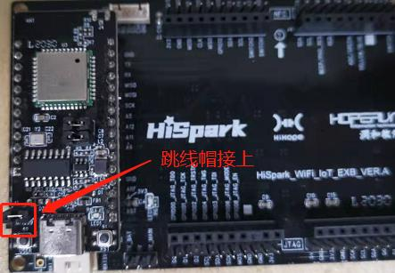
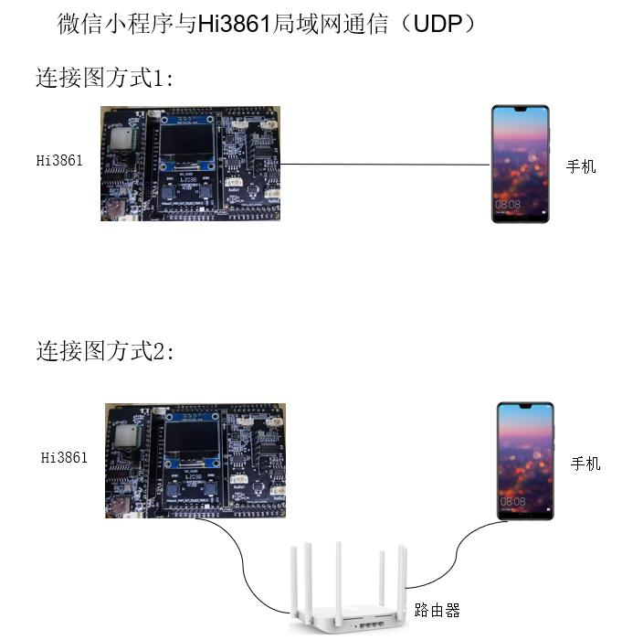
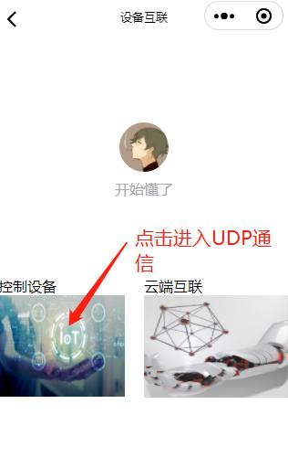
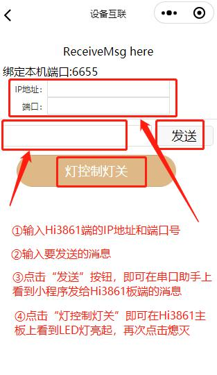

### 微信小程序基于UDP局域网和Hi3861板端互联
    注意：学习这章前，请先学习腾讯云的微信小程序开发及Hi3861板端互联章节。

## 硬件环境搭建
-    硬件要求：Hi3861V100核心板、扩展板；硬件搭建以及组网图。如下图所示。
-    [Hi3861V100核心板参考：HiSpark_WiFi_IoT智能开发套件_原理图硬件资料\原理图\HiSpark_WiFi-IoT_Hi3861_CH340G_VER.B.pdf](http://gitee.com/hihope_iot/embedded-race-hisilicon-track-2022/blob/master/%E7%A1%AC%E4%BB%B6%E8%B5%84%E6%96%99/HiSpark_WiFi_IoT%E6%99%BA%E8%83%BD%E5%AE%B6%E5%B1%85%E5%BC%80%E5%8F%91%E5%A5%97%E4%BB%B6_%E5%8E%9F%E7%90%86%E5%9B%BE.rar)
-    [扩展板参考：HiSpark_WiFi_IoT智能开发套件_原理图硬件资料\原理图\HiSpark_WiFi-IoT_Hi3861_CH340G_VER.B.pdf](http://gitee.com/hihope_iot/embedded-race-hisilicon-track-2022/blob/master/%E7%A1%AC%E4%BB%B6%E8%B5%84%E6%96%99/HiSpark_WiFi_IoT%E6%99%BA%E8%83%BD%E5%AE%B6%E5%B1%85%E5%BC%80%E5%8F%91%E5%A5%97%E4%BB%B6_%E5%8E%9F%E7%90%86%E5%9B%BE.rar)





## 软件介绍

-   1.代码目录结构及相应接口功能介绍
```
vendor_hisilicon/hispark_pegasus/demo/udp_demo
├── BUILD.gn            # BUILD.gn文件由三部分内容（目标、源文件、头文件路径）构成,开发者根据需要填写,static_library中指定业务模块的编译结果，为静态库文件led_example，开发者根据实际情况完成填写。
|                         sources中指定静态库.a所依赖的.c文件及其路径，若路径中包含"//"则表示绝对路径（此处为代码根路径），若不包含"//"则表示相对路径。include_dirs中指定source所需要依赖的.h文件路径。
├── udp_client.c        #
├── udp_config.h        # 
├── udp_server.c        # 
├── wifi_softap.c       # 
├── wifi_softap.h       # 
├── oled_ssd1306.c      # 
└── wifi_sta_connect.c  # 
```
-   2.udp_demo工程编译烧录
    -   将源码./vendor/hisilicon/hispark_pegasus/demo目录下的udp_demo整个文件夹及内容复制到源码./applications/sample/wifi-iot/app/下。
    ```
    .
    └── applications
        └── sample
            └── wifi-iot
                └── app
                    └──udp_demo
                       └── 代码   
    ```

    -   配置源码./applications/sample/wifi-iot/app/udp_demo/udp_config.h中AP_SSID，AP_PWD为WiFi名称和WiFi密码，这里注意手机与Hi3861V100需要在同一个局域网内。
    ```
    #define AP_SSID  "xxx" // WIFI SSID
    #define AP_PWD "xxxxxx" // WIFI PWD
    ```

    -    改源码./applications/sample/wifi-iot/app下的BUILD.gn文件，在features字段中增加索引，使目标模块参与编译。features字段指定业务模块的路径和目标,features字段配置如下。
    ```
    import("//build/lite/config/component/lite_component.gni")
    
    lite_component("app") {
        features = [
            "udp_demo:udpServer",
        ]
    }
    ```

    -    修改完成后rebuild编译,烧录到Hi3861V100开发板上，烧录成功后，再次点击Hi3861核心板上的“RST”复位键，在串口工具栏可以看到板端IP地址。
    -    配置源码./applications/sample/wifi-iot/app/udp_demo/udp_server.c，将Hi3861本机的IP地址（上面查到的IP地址）填入NATIVE_IP_ADDRESS宏定义中，并设置本机端口号HOST_PORT宏定义中，客户端端口号DEVICE_PORT宏定义中（用户可自行设置）。
    -    工程相关配置完成后,然后编译烧录。
-    3.微信小程序编译预览
    -    打开微信小程序，在msgSendRead.js文件中var port = udp.bind()中填入DEVICE_PORT(代码里面对应的端口号),然后编译预览。
    -    点击电脑端微信小程序选择预览，手机扫码进入微信小程序，首先进行配网，如果手机端已经配网则可以跳过，然后点击“控制设备”下方的按钮进入UDP通信并控制设备侧,输入板端IP地址，端口填入本机端口号HOST_PORT。如下图所示。

   
